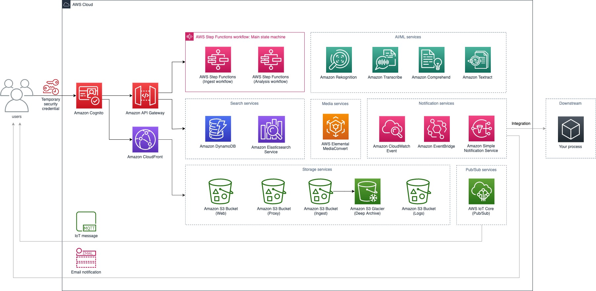
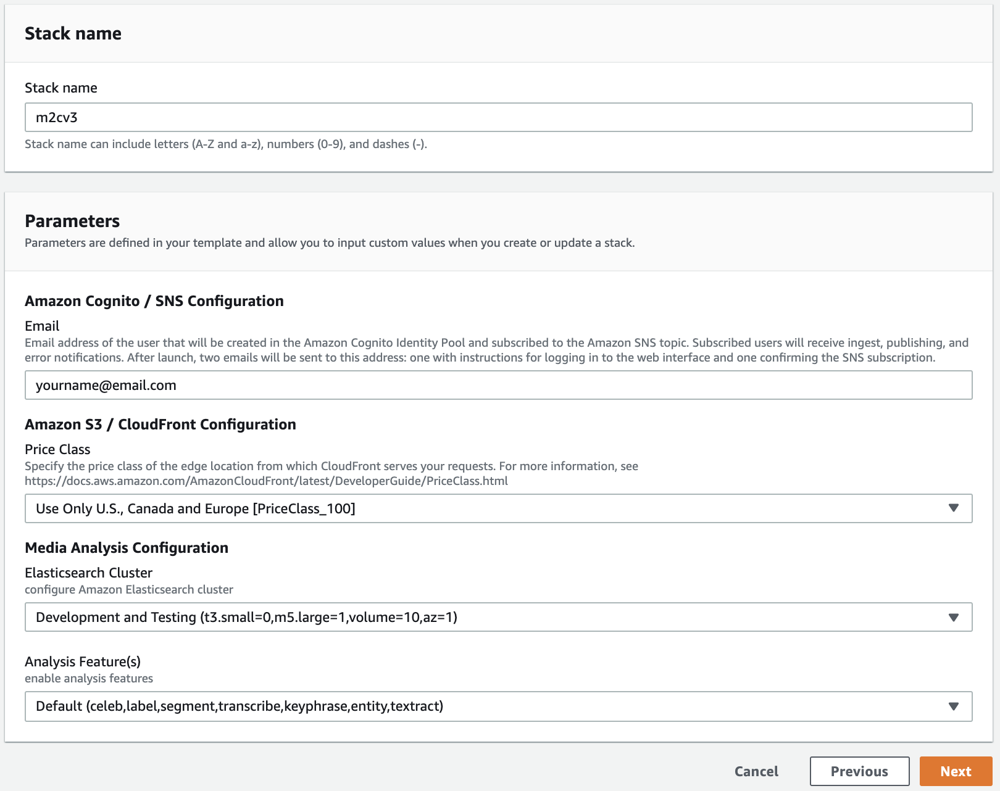
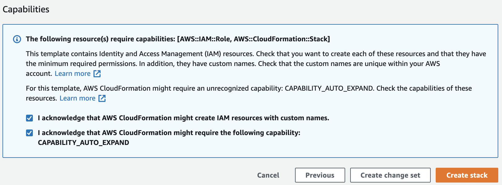

# AWS Media2Cloud Solution Version 3 Preview

## # IMPORTANT NOTE
This is a **Preview beta** of Media2Cloud Version 3. If you are looking for a stable version, please use the published version (Version 2) from our [AWS Solutions](https://aws.amazon.com/solutions/implementations/media2cloud/).

__

## What's new in V3?

* New web user interface makes it easier to navigate different categories
* Added Stats view lets you visualize your library
* Built-in queue management to handle large requests of Amazon Rekognition Video processes
* [Amazon EventBridge](https://docs.aws.amazon.com/eventbridge/latest/userguide/what-is-amazon-eventbridge.html) makes it easily to integrate V3 CloudWatch events into your downstream processes by configuring an Amazon CloudWatch Event Rule to trigger your own workflows
* [Amazon Rekognition Video Segment API](https://docs.aws.amazon.com/rekognition/latest/dg/segment-api.html) allows you to analyze video shot change and technical cues such as black frame, color bar, and end credits event. V3 also converts segment results into Edit Decision List (EDL) format allowing you to import the shot timeline to popular editing software such as Adobe Premerie Pro and BlackMagic DaVinci Resolve
* [Amazon Rekognition Custom Labels](https://aws.amazon.com/rekognition/custom-labels-features/) feature is our AutoML service that lets you easily train computer vision models such as image classification and object detection model. Although V3 doesn't train CL model for you, it can use the CL models you have already trained to analyze both image and _video_ assets. To train a CL model, check out this open source [custom brand detection](https://github.com/aws-samples/amazon-rekognition-custom-brand-detection) project. V3 also manages (auto-start and stop) the runtime of your CL models to minimize the inference cost
* _Frame based analysis_ lets you specify the framerate to run Amazon Rekognition Image API instead of Amazon Rekognition Video API. (Note that Amazon Rekognition Segment API and Amazon Rekognition Person Pathing API continue to use the Video API.)
* Integrated [Amazon Transcribe Custom Language Model (CLM)](https://docs.aws.amazon.com/transcribe/latest/dg/create-custom-language-model.html) and [Amazon Transcribe Custom Vocabulary](https://docs.aws.amazon.com/transcribe/latest/dg/how-vocabulary.html) features that improve the transcription results. Check out this blog post [Building custom language models to supercharge speech-to-text performance for Amazon Transcribe](https://aws.amazon.com/blogs/machine-learning/building-custom-language-models-to-supercharge-speech-to-text-performance-for-amazon-transcribe/)
* Last but not least, Media2Cloud V3 got its own logo!

__

## Introduction

AWS Media2Cloud solution is designed to demonstrate a serverless ingest and analysis framework that can quickly setup a baseline ingest and analysis workflow for placing video, image, audio, and document assets and associated metadata under management control of an AWS customer. The solution will setup the core building blocks that are common in an ingest and analysis strategy:
* Establish a storage policy that manages master materials as well as proxies generated by the ingest process.
* Provide a unique identifier (UUID) for each master video asset.
* Calculate and provide a MD5 checksum.
* Perform a technical metadata extract against the master asset.
* Build standardized proxies for use in a media asset management solution.
* Run the proxies through audio, video, image analysis.
* Provide a serverless dashboard that allows a developer to setup and monitor the ingest and analysis process.

See it in action!


__

## Architecture overview



__

## Installation

Media2Cloud uses Amazon CloudFormation service to orchestrate the entire workflow. Follow the steps below to create and install the solution.

**Step 1: Click on the pre-built Amazon CloudFormation template for the region you would like to deploy the solution**

| AWS Region | Amazon CloudFormation template |
| :--- | :---------- |
| US East (N. Virginia) | <a href="https://console.aws.amazon.com/cloudformation/home?region=us-east-1#/stacks/new?stackName=m2cv3&templateURL=https://ml-specialist-sa-demo-us-east-1.s3.amazonaws.com/media2cloud/v3preview/media2cloud.template" target="_blank">Launch stack</a> |
| US West (Oregon) | <a href="https://console.aws.amazon.com/cloudformation/home?region=us-west-2#/stacks/new?stackName=m2cv3&templateURL=https://ml-specialist-sa-demo-us-west-2.s3-us-west-2.amazonaws.com/media2cloud/v3preview/media2cloud.template" target="_blank">Launch stack</a> |
| Europe (Ireland) | <a href="https://console.aws.amazon.com/cloudformation/home?region=eu-west-1#/stacks/new?stackName=m2cv3&templateURL=https://ml-specialist-sa-demo-eu-west-1.s3-eu-west-1.amazonaws.com/media2cloud/v3preview/media2cloud.template" target="_blank">Launch stack</a> |

__

**Step 2: Under 'Specify stack details' page, fill in parameters**



| Parameter | Description |
| :--- | :---------- |
| Stack name | Specify stack name. Note that the stack name is also used to prefixing resources being created. |
| Email | Your email address is used to create an user to log in to the web portal using [Amazon Cognito](https://aws.amazon.com/cognito/) service |
| Price Class | Amazon CloudFront distribution. See more details of different [price classes](https://docs.aws.amazon.com/AmazonCloudFront/latest/DeveloperGuide/PriceClass.html) |
| Elasticsearch Cluster | Different options to configure Amazon Elasticsearch Service cluster. Recommended to use _Development and Testing_ if you are simply evaluating Media2Cloud |
| Analysis Feature(s) | Different default options to configure which detections you would like to run |

__

**Step 3: Next to 'Configure stack options'**

Leave it as is

__

**Step 3: Next to 'Review stack'**

Scroll down to the bottom of the page. Make sure
* I acknowledge that AWS CloudFormation might create IAM resources with custom names.
* I acknowledge that AWS CloudFormation might require the following capability: CAPABILITY_AUTO_EXPAND

are checked as shown below.



Click on _Create stack_ will start the stack creation process. It takes approximately 15 minutes to complete. When the stack is created, you should receive an email with a temporary credentials to log in to the web portal.

__

## Build Environment
The sample code is written in ```NodeJS v14.x```. Before you start, please make sure NodeJS has been installed. You would also need to create an Amazon Simple Storage Service (Amazon S3) bucket to store the build artifacts. 

_

### ## NodeJS

For MAC user, download and install from [nodejs.org](https://nodejs.org/en/download/). Alternatively, you can also use [Homebrew](https://brew.sh/).

For Linux or Amazon EC2 user, follow [Tutorial: Setting Up Node.js on an Amazon EC2 Instance](https://docs.aws.amazon.com/sdk-for-javascript/v2/developer-guide/setting-up-node-on-ec2-instance.html)

For Windows 10 user, make sure to install [Windows Subsystem for Linux](https://docs.microsoft.com/en-us/windows/wsl/install-win10) before installing ```NodeJS```. The build and deploy scripts are written in Bash script.

_

### ## AWS CLI

```deploy-s3-dist.sh``` shell script uploads the build artifacts to your S3 bucket; thus, it requires [AWS CLI](https://docs.aws.amazon.com/cli/latest/userguide/cli-chap-install.html) to be installed and configured.

```shell
# after AWS CLI is installed, run the command and follow the instruction to configure your profile

aws configure

```

_

### ## JQ, a command line JSON processor 

```deploy-s3-dist.sh``` also uses [jq](https://stedolan.github.io/jq/) to parse JSON file. Download and install [jq](https://stedolan.github.io/jq/) on your build system.

__

## Building and customizing the solution


1) Create a bucket in the AWS region you would like to deploy the solution. For example, **my-bucket** in us-east-1 region.
2) Make sure to specify ```--single-region``` in the command line

  ```shell
  bash ./build-s3-dist.sh --bucket my-bucket --single-region
  ```

3) Deploy the distributable to an Amazon S3 bucket in your account. _Note:_ you must have the AWS Command Line Interface installed.

  ```shell
  bash ./deploy-s3-dist.sh --bucket my-bucket --single-region
  ```

4) Get the HTTPS URL link of ```media2cloud.template``` after you have uploaded to your Amazon S3 bucket.

5) Deploy the solution to your account by launching a new AWS CloudFormation stack using the link of the ```media2cloud.template```.

__

## Code structure

| Path | Description |
| :--- | :---------- |
| deployment/ | -- |
| deployment/build-s3-dist.sh | shell script to build packages |
| deployment/deploym-s3-dist.sh | shell script to deploy packages to your Amazon S3 bucket |
| deployment/media2cloud.yaml | main Amazon CloudFormation template to deploy the stack |
| source/ | -- |
| source/api | Amazon API Gateway handler |
| source/backlog | implementation of internal queue management to handle large numbers of Amazon Rekognition Video requests |
| source/build | build script used by build-s3-dist.sh |
| source/custom-resources | lambda function used by Amazon CloudFormation during stack creation and deletion |
| LAYERS | -- |
| source/layers | directory of various AWS Lambda Layers |
| source/layers/aws-sdk-layer | latest AWS SDK layer |
| source/layers/canvas-lib | canvas layer for manipulating images |
| source/layers/core-lib | core library shared by all lambdas |
| source/layers/fixity-lib | fixity library to compute MD5/SHA1 |
| source/layers/image-process-lib | wrapper to exif-tool to extract image metadata |
| source/layers/mediainfo | mediainfo layer |
| source/layers/pdf-lib | wrapper of pdfjs package |
| source/layers/service-backlog-lib | service backlog of internal queu management |
| WORKFLOWS | -- |
| [source/main](./source/main/README.md) | main state machine |
| [source/main/ingest](./source/main/ingest/README.md) | ingest state machine implementation |
| [source/main/analysis](./source/main/analysis/README.md) | analysis state machine implementation |
| source/main/automation | triggers and automations of workflows |
| WEBAPP | -- |
| [source/webapp](./source/webapp/README.md) | implementation of webapp |

__

## TODO

* Support Amazon Rekognition Custom Labels feature for Image analysis state machine 
* Amazon Elasticsearch engine enhancement - creating indexes for each type of detections
* Enhancing webapp Statistics page to display AI/ML metadata stats
* Unit tests!


__


## License

Copyright 2021 Amazon.com, Inc. and its affiliates. All Rights Reserved.

SPDX-License-Identifier: LicenseRef-.amazon.com.-AmznSL-1.0

Licensed under the Amazon Software License (the "License").
You may not use this file except in compliance with the License.
A copy of the License is located at

  http://aws.amazon.com/asl/

or in the "license" file accompanying this file. This file is distributed
on an "AS IS" BASIS, WITHOUT WARRANTIES OR CONDITIONS OF ANY KIND, either
express or implied. See the License for the specific language governing
permissions and limitations under the License.
