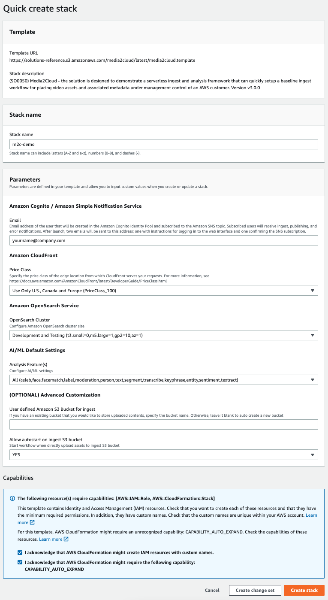
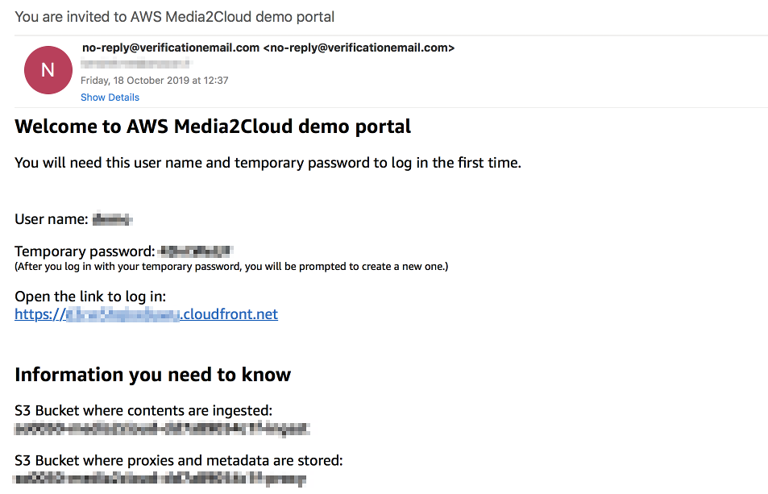

## Tutorial 1: Creating the Media2Cloud solution using AWS CloudFormation service

In this tutorial, we will walk through the steps to create your first Media2Cloud solution on AWS using AWS CloudFormation service. If you are not familiar with AWS CloudFormation service, [click here](https://aws.amazon.com/cloudformation/) to learn more.

Two options we will discuss:
* [Option 1: Launch stack on AWS Console](#option-1-launching-stack-on-aws-console)
* [Option 2: Launching stack using AWS CLI](#option-2-launching-stack-using-aws-cli)

__

### Option 1: Launching stack on AWS Console

Click on the `Launch stack` (below) in the region that you would like to deploy Media2Cloud stack.

| AWS Region | AWS CloudFormation Template URL |
|:-----------|:----------------------------|
| EU (Ireland) |<a href="https://console.aws.amazon.com/cloudformation/home?region=eu-west-1#stacks/create/review?stackName=m2c-demo&templateURL=https://solutions-reference.s3.amazonaws.com/media2cloud/latest/media2cloud.template" target="_blank">Launch stack</a> |
| US East (N. Virginia) |<a href="https://console.aws.amazon.com/cloudformation/home?region=us-east-1#stacks/create/review?stackName=m2c-demo&templateURL=https://solutions-reference.s3.amazonaws.com/media2cloud/latest/media2cloud.template" target="_blank">Launch stack</a> |
| US East (Ohio) |<a href="https://console.aws.amazon.com/cloudformation/home?region=us-east-2#stacks/create/review?stackName=m2c-demo&templateURL=https://solutions-reference.s3.amazonaws.com/media2cloud/latest/media2cloud.template" target="_blank">Launch stack</a> |
| US West (Oregon) |<a href="https://console.aws.amazon.com/cloudformation/home?region=us-west-2#/stacks/quickcreate?stackName=m2c-demo&templateURL=https://solutions-reference.s3.amazonaws.com/media2cloud/latest/media2cloud.template" target="_blank">Launch stack</a> |

_



| Name | Description |
| :--- | :---------- |
| Stack name | Specify a stack name |
| Email | Specify your email address to create the login credential to the Media2Cloud Web Portal and also receive Amazon SNS notifications of the workflow |
| Price Class | [Choosing the price class for a CloudFront distribution](https://docs.aws.amazon.com/AmazonCloudFront/latest/DeveloperGuide/PriceClass.html). If you don't know what price class to choose, leave it as it |
| OpenSearch Cluster | Specify the cluster size of the search engine. `Development and Testing (t3.medium=0,m5.large=1,gp2=10,az=1)` creates a single instance. |
| Analysis Feature(s) | Specify the default AI/ML detections you would like to run. For best results, select `All (celeb,face,facematch,label,moderation,person,text,segment,transcribe,keyphrase,entity,sentiment,textract)` |
| User defined Amazon S3 Bucket for ingest | Allows you to configure the Media2Cloud instance to use your existing content bucket. Leave it blank the stack will create an Amazon S3 bucket, `ingest bucket` for you |
| Allow autostart on ingest S3 Bucket | For this mini workshop, specify `NO`. In [Tutorial 3: Automating the ingest workflow with Amazon EventBridge](./3-automate-ingest-analysis-workflow.md), we will discuss and create our own automation workflow. |


Make sure the following capabilities are checked:
- [x] I acknowledge that AWS CloudFormation might create IAM resources with custom names.
- [x] I acknowledge that AWS CloudFormation might require the following capability: CAPABILITY_AUTO_EXPAND

Click **Create stack** to create the solution.

__

### Option 2: Launching stack using AWS CLI

Instead of using AWS CloudFormation Console, we will create our Media2Cloud stack using AWS CLI command. 


```shell

#
# Create stack
#
aws cloudformation create-stack \
  --stack-name \
    m2c-demo \
  --template-url \
    https://solutions-reference.s3.amazonaws.com/media2cloud/latest/media2cloud.template \
  --parameters \
    "ParameterKey=Email,ParameterValue=\"yourname@company.com\"" \
    "ParameterKey=PriceClass,ParameterValue=\"Use Only U.S., Canada and Europe (PriceClass_100)\"" \
    "ParameterKey=OpenSearchCluster,ParameterValue=\"Development and Testing (t3.medium=0,m5.large=1,gp2=10,az=1)\"" \
    "ParameterKey=DefaultAIOptions,ParameterValue=\"All (celeb,face,facematch,label,moderation,person,text,segment,transcribe,keyphrase,entity,sentiment,textract)\"" \
    "ParameterKey=StartOnObjectCreation,ParameterValue=\"NO\"" \
  --capabilities \
    "CAPABILITY_IAM" \
    "CAPABILITY_NAMED_IAM" \
    "CAPABILITY_AUTO_EXPAND"

#
# Wait for the stack creation completes
#
aws cloudformation wait stack-create-complete \
  --stack-name m2c-demo \
  --region us-east-1

#
# Describe stack outputs
#
aws cloudformation describe-stacks \
  --stack-name m2c-demo
  --region us-east-1 | \
    jq '.Stacks[0].Outputs[]'

```

__

## Wait for a Welcome email

The stack takes about 20 minutes to complete. When it is completed, you should receive an email from `no-reply@verificationemail.com` which contains the URL and temporary login credentials to our first Media2Cloud solution.



__

## Log in to Media2Cloud Web Portal

Click on the URL link in the **Welcome email** and sign in with the temporary credentials provided in the email. Use [Google Chrome](https://www.google.com/chrome/) to open the Media2Cloud web portal. The first time you open and sign in to the web portal, you will be prompted to reset your password.

Now, we can start uploading images and videos using the web user interface.

__

Next to [Tutorial 2: Using the Media2Cloud RESTful APIs to ingest and search contents](./2-using-media2cloud-restful-api.md)
