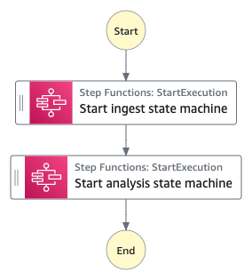

# Main State Machine

The main state machine is the entry point to process a new ingest request. It serializes the ingest workflow and analysis workflow using [AWS Step Function Nested Workflows](https://docs.aws.amazon.com/step-functions/latest/dg/concepts-nested-workflows.html) technique.



## State machine definition

```json
{
    "Comment": "main state machine to run ingest and anlysis sub state machines",
    "StartAt": "Start ingest state machine",
    "States": {
        "Start ingest state machine": {
            "Type": "Task",
            "Resource": "arn:aws:states:::states:startExecution.sync",
            "Parameters": {
                "Input": {
                    "input.$": "$.input"
                },
                "StateMachineArn": "${IngestStateMachine}"
            },
            "ResultSelector": {
                "ingestOutput.$": "States.StringToJson($.Input)"
            },
            "Next": "Start analysis state machine"
        },
        "Start analysis state machine": {
            "Type": "Task",
            "Resource": "arn:aws:states:::states:startExecution.sync",
            "Parameters": {
                "Input": {
                    "uuid.$": "$.ingestOutput.input.uuid",
                    "input.$": "$.ingestOutput.input"
                },
                "StateMachineArn": "${AnalysisStateMachine}"
            },
            "End": true
        }
    }
}

```
The main state machine starts and waits the ingest workflow where it creates and standardizes proxies. When the ingest workflow successfully completes, it transitions to the analysis workflow to extract AI/ML metadata.

__

## Execution input

```json
{
  "input": {
    "uuid": "UUID",
    "bucket": "INGEST_BUCKET",
    "key": "S3_OBJECT_KEY",
    "destination": {
      "bucket": "PROXY_BUCKET",
      "prefix": "PREFIX"
    },
    "group": "GROUP",
    "attributes": {
        "key01": "value01",
        ...
    },
    "aiOptions": {
        "celeb": true,
        "label": false,
        ...
    }
  }
}
```

| Field | Description | Required? |
| :-----| :-----------| :---------|
| input.uuid | Universally unique identifier (Version 4) | Mandatory |
| input.bucket | Ingest bucket where it stores the uploaded media file | Mandatory |
|input.key | Location of the uploaded media file | Mandatory |
| _input.destination.bucket_ | Proxy bucket where it stores generated proxies, thumbnail images, AI/ML metadata JSON files. If not specified, it uses the proxy bucket created by the solution | Optional |
| _input.destination.prefix_ | Location of where to store generated proxies, thumbnail images, AI/ML metadata JSON files. If not specified, it uses the UUID prefix. | Optional |
| _input.group_ | Grouping multiple uploaded media files and store them in the ingest bucket with a top-level prefix of the specified "GROUP" | Optional |
| _input.attributes.*_ | key value pair of additional attributes of the media file, stored as object metadata. | Optional |
| _input.aiOptions.*_ | AI/ML options to run the analysis workflow. If not specified, the solution uses the default AI/ML options specified when the Amazon CloudFormation stack was created | Optional |

__

## Related topics
* [Ingest Main State Machine](./ingest/main/README.md)
* [Analysis Main State Machine](./analysis/main/README.md)
* [State Machine Error Handling](./automation/error-handler/README.md)
* [Triggering ingest and analysis workflow with Amazon S3 Event Notification](./automation/s3event/README.md)

__

Back to [Table of contents](../../README.md#table-of-contents)
