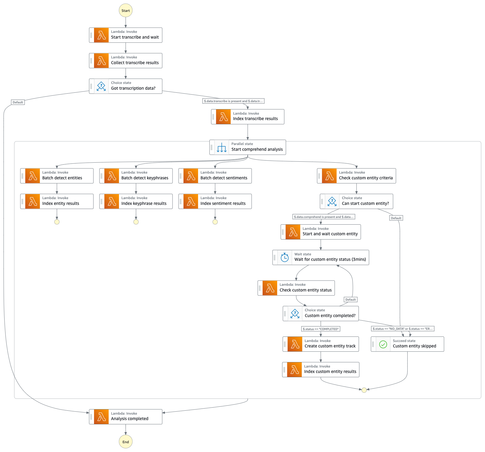
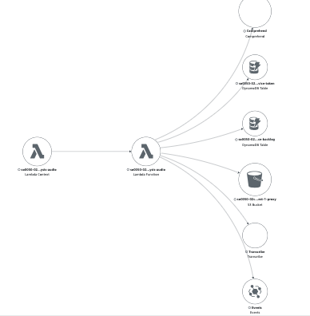

# Audio Analysis State Machine

The Audio Analysis State Machine focuses on analyzing the audio part of the ingested media file. It uses Amazon Transcribe, Automatic Speech Recognition (ASR) service to convert speech dialogues to a transcript and generate subtitle file in WebVTT format. The transcript is then further analyzed by Amazon Comprehend, Natural Language Processing (NLP) service to extract entities, keyphrases, sentiments, organization and quantities.

In V4, the Audio Analysis also leverages Amazon Bedrock Anthropic Claude 3 Haiku (or Sonnet) model to analyze the transcript and provide a breakdown of how the conversational topics has significantly changed over the entire duration of the content.



## Execution input

The state execution input is similar to the [Analysis Main State Machine](../main/README.md#execution-input) with additional fields relevant to the audio analysis workflow.


```json
{
  "input": {
    "duration": 579570,
    "aiOptions": {
      "transcribe": true,
      "languageCode": "en-US",
      "toxicity": false,
      "customLanguageModel": "[CUSTOM_LANGUAGE_MODEL]",
      "customVocabulary": "[CUSTOM_VOCABULARY]",
      "keyphrase": true,
      "entity": true,
      "sentiment": true,
      "customentity": true,
      "customEntityRecognizer": "[CUSTOM_ENTITY_RECOGNIZER]",
      "filters": {
        "transcribe": {
          "analyseConversation": true
        }
      }
    },
    "audio": {
      "enabled": true,
      "key": "[PROXY_M4A_FILE]"
    },
    "request": {
      "timestamp": 1711518537081
    }
  }
}

```

## State Descriptions

#### _State: Start transcribe and wait_

The lambda function leverages the [Service Backlog Management System](../../../layers/service-backlog-lib/README.md) to queue the transcribe job request and wait for the request to be processed. The Backlog system runs the Amazon Transcribe StartTranscriptionJob API and sends the task result back to the Audio Analysis State Machine when the transcription job is completed.

#### _State: Collect transcribe results_

The lambda function ensures the transcription JSON output and the subtitle WebVTT files are present. If the transcription is present, the lambda function sends the WebVTT output to Amazon Bedrock Anthropic Claude 3 Haiku (or Sonnet) to analyze the transcript and provide a breakdown of the conversation topics.

```json

{
  "usage": {
    "inputTokens": 11594,
    "outputTokens": 551
  },
  "chapters": [
    {
      "start": "00:00:25.600",
      "end": "00:01:30.019",
      "reason": "This part introduces the show and the host, setting up the premise of visiting startups using technology to improve the world."
    },
    ...
  ]
}

```

#### _State: Got transcription data?_

The Choice state checks if the transcription output and WebVTT files are present. If both are present, the workflow executes the next step, "Index transcribe results". Otherwise, it skips the rest of the NLP analysis and moves to "Analysis completed" step.

#### _State: Index transcribe results_

The lambda function indexes the "timestamped" dialogues from the WebVTT subtitle output to the Amazon OpenSearch cluster.

#### _State: Start comprehend analysis_

This Parallel state begins to run various NLP analysis branches concurrently.

#### _State: Batch detect entities_

The lambda function uses Amazon Comprehend BatchDetectEntities API to extract entities from the transcript and converts the "character" offset of the detected entities into a timestamp-based format.

#### _State: Index entity results_

The lambda function indexes the entity results with timestamps to the Amazon OpenSearch cluster.

#### _State: Batch detect keyphrases_

The lambda function uses Amazon Comprehend BatchDetectKeyPhrases API to analyze the transcript for keyphrases.

#### _State: Index keyphrase results_

The lambda function indexes the keyphrase results with timestamps to the Amazon OpenSearch cluster.

#### _State: Batch detect sentiments_

The lambda function uses Amazon Comprehend BatchDetectSentiment API to analyze the sentiment of the transcript.

#### _State: Index sentiment results_

The lambda function indexes the sentiment results with timestamps to the Amazon OpenSearch cluster.

#### _State: Check custom entity criteria_

The lambda function ensures the custom entity recognizer is trained with the same language as the language of the transcription output.

#### _State: Can start custom entity?_

The Choice state determines if the custom entity analysis can be started based on the criteria.

#### _State: Start and wait custom entity_

The lambda function registers a job to the Service Backlog system to analyze the transcript using the custom entity recognizer and waits for the job to complete.

#### _State: Wait for custom entity status (3mins)_

The Wait state waits for 3 minutes before rechecking the custom entity job status.

#### _State: Check custom entity status_

The lambda function checks the status of the custom entity job and updates the `$.status` accordingly.

#### _State: Custom entity completed?_

The Choice state evaluates the custom entity job status and either continues the analysis in the next step or skips the custom entity analysis.

#### _State: Create custom entity track_

The lambda function converts the text-based custom entity outputs into timestamp-based output.

#### _State: Index customentity results_

The lambda function indexes the custom entity results with timestamps to the Amazon OpenSearch cluster.

#### _State: Custom entity skipped_

A Succeed state indicates the custom entity branch is skipped.

#### _State: Analysis completed_

After the parallel branches have completed, the lambda function merges the parallel outputs.

## Metadata location

The Audio Analysis State Machine generates various output files, which are stored in the specified locations.

|Output|Location|
|:--|:--|
|**Amazon Transcribe**||
|Original transcription|s3://[PROXY_BUCKET]/[UUID]/[FILENAME]/raw/[DATE_TIME]/transcribe/[FILENAME].json|
|Original WebVTT subtitle|s3://[PROXY_BUCKET]/[UUID]/[FILENAME]/raw/[DATE_TIME]/transcribe/[FILENAME].vtt|
|Conversation analysis|s3://[PROXY_BUCKET]/[UUID]/[FILENAME]/raw/[DATE_TIME]/transcribe/conversation.json|
|**Amazon Comprehend Entity**||
|Original entities (JSONL)|s3://[PROXY_BUCKET]/[UUID]/[FILENAME]/raw/[DATE_TIME]/comprehend/entity/output.manifest|
|Generated metadata|s3://[PROXY_BUCKET]/[UUID]/[FILENAME]/metadata/entity/output.json|
|**Amazon Comprehend Keyphrase**||
|Original keyphrase (JSONL)|s3://[PROXY_BUCKET]/[UUID]/[FILENAME]/raw/[DATE_TIME]/comprehend/keyphrase/output.manifest|
|Generated metadata|s3://[PROXY_BUCKET]/[UUID]/[FILENAME]/metadata/keyphrase/output.json|
|**Amazon Comprehend Sentiment**||
|Original sentiment (JSONL)|s3://[PROXY_BUCKET]/[UUID]/[FILENAME]/raw/[DATE_TIME]/comprehend/sentiment/output.manifest|
|Generated metadata|s3://[PROXY_BUCKET]/[UUID]/[FILENAME]/metadata/sentiment/output.json|
|**Amazon Comprehend Custom Entity**||
|Original custom entity (JSONL)|s3://[PROXY_BUCKET]/[UUID]/[FILENAME]/raw/[DATE_TIME]/comprehend/customentity/output.manifest|
|Generated metadata|s3://[PROXY_BUCKET]/[UUID]/[FILENAME]/metadata/customentity/output.json|

## AWS Lambda function (analysis-audio)

The analysis-audio lambda function provides the implementation to support different states of the Analysis Document state machine.

## IAM Role Policy

The IAM role policy for the analysis-audio lambda function is provided.

```json
{
    "Version": "2012-10-17",
    "Statement": [
        {
            "Action": [
                "logs:CreateLogGroup",
                "logs:CreateLogStream",
                "logs:PutLogEvents"
            ],
            "Resource": "[CLOUDWATCH_LOGS]",
            "Effect": "Allow"
        },
        {
            "Action": "s3:ListBucket",
            "Resource": "[PROXY_BUCKET]",
            "Effect": "Allow"
        },
        {
            "Action": [
                "s3:GetObject",
                "s3:PutObject"
            ],
            "Resource": "[PROXY_BUCKET]",
            "Effect": "Allow"
        },
        {
            "Action": [
                "dynamodb:Scan",
                "dynamodb:Query",
                "dynamodb:PutItem",
                "dynamodb:UpdateItem",
                "dynamodb:DeleteItem"
            ],
            "Resource": "[SERVICE_TOKEN_TABLE]",
            "Effect": "Allow"
        },
        {
            "Action": [
                "comprehend:BatchDetectDominantLanguage",
                "comprehend:BatchDetectEntities",
                "comprehend:BatchDetectKeyPhrases",
                "comprehend:BatchDetectSentiment",
                "comprehend:BatchDetectSyntax",
                "comprehend:StartEntitiesDetectionJob",
                "comprehend:StartKeyPhrasesDetectionJob",
                "comprehend:StartDominantLanguageDetectionJob",
                "comprehend:StartSentimentDetectionJob",
                "comprehend:StartTopicsDetectionJob",
                "comprehend:StopDominantLanguageDetectionJob",
                "comprehend:StopEntitiesDetectionJob",
                "comprehend:StopKeyPhrasesDetectionJob",
                "comprehend:StopSentimentDetectionJob",
                "comprehend:DescribeDominantLanguageDetectionJob",
                "comprehend:DescribeEntitiesDetectionJob",
                "comprehend:DescribeKeyPhrasesDetectionJob",
                "comprehend:DescribeSentimentDetectionJob",
                "comprehend:DescribeTopicsDetectionJob"
            ],
            "Resource": "*",
            "Effect": "Allow"
        },
        {
            "Action": "comprehend:DescribeEntityRecognizer",
            "Resource": "[CUSTOM_ENTITY_RECOGNIZER]",
            "Effect": "Allow"
        },
        {
            "Action": [
                "transcribe:GetTranscriptionJob",
                "transcribe:StartTranscriptionJob",
                "transcribe:GetVocabulary",
                "transcribe:DescribeLanguageModel"
            ],
            "Resource": "*",
            "Effect": "Allow"
        },
        {
            "Action": "iam:PassRole",
            "Resource": "[DATA_ACCESS_ROLE]",
            "Effect": "Allow"
        },
        {
            "Action": "events:PutEvents",
            "Resource": "[SERVICE_BACKLOG_EVENTBUS]",
            "Effect": "Allow"
        },
        {
            "Action": [
                "es:ESHttpGet",
                "es:ESHttpHead",
                "es:ESHttpPost",
                "es:ESHttpPut",
                "es:ESHttpDelete"
            ],
            "Resource": "[OPENSEARCH_DOMAIN]",
            "Effect": "Allow"
        },
        {
            "Action": "aoss:APIAccessAll",
            "Resource": "[OPENSEARCH_SERVERLESS_COLLECTION]",
            "Effect": "Allow"
        }
    ]
}

```

#### _IAM Role Policy (Amazon Bedrock)_

```json
{
    "Version": "2012-10-17",
    "Statement": [
        {
            "Action": "bedrock:ListFoundationModels",
            "Resource": "*",
            "Effect": "Allow"
        },
        {
            "Action": "bedrock:InvokeModel",
            "Resource": "[ANTHROPIC_CLAUDE_3_MODEL]",
            "Effect": "Allow"
        }
    ]
}

```

## X-Ray Trace

The AWS XRAY trace diagram demonstrates the AWS services the analysis-audio lambda function communicates with.



## Related topics

- [Service Backlog Management System](../../../layers/service-backlog-lib/README.md)
- [Analysis Workflow Status Updater](../automation/status-updater/README.md)

__

Back to [Analysis Main State Machine](../main/README.md) | Back to [Table of contents](../../../../README.md#table-of-contents)