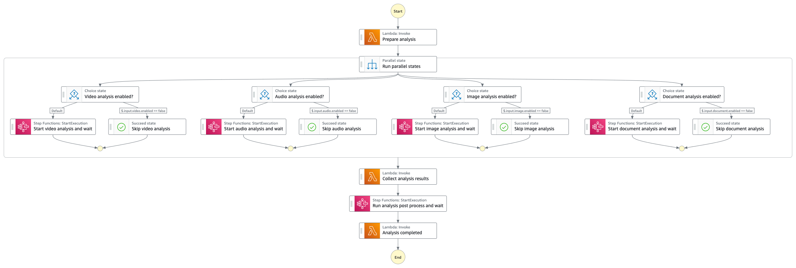

# Analysis Main State Machine

The Analysis Main State Machine focuses on extracting machine learning metadata from the media file. Depending on the media type of the file and the types of AI/ML detection specified in the request, the Analysis Main State Machine activates different branches of the detections. For instance, if the media file is a document, the analysis workflow focuses on extracting tabular data from the document using Amazon Textract service. If the uploaded file is a video file, the analysis workflow activates the video analysis workflow to extract visual data using Amazon Rekognition service _AND_ the audio analysis workflow to extract speech-to-text data using Amazon Transcribe service as well as to run Natural Language Processing (NLP) process to extract key phrases, entities, locations, quantities, and so fort using Amazon Comprehend service.



__

## Execution input
The state machine execution input is a pass through from the [Main State Machine](../README.md) where the mandatory field is the ```input.uuid``` used to look up the the ingestion data from the Ingest DynamoDB Table. 

```json
{
  "input": {
    "uuid": "UUID",
    "aiOptions": {
        "celeb": true,
        "label": false,
        ...
    }
  }
}
```

| Field | Description | Required? |
| :-----| :-----------| :---------|
| input.uuid | UUID of the media file used to look up the ingest data from Ingest DynamoDB Table | Mandatory |
| _input.aiOptions.*_ | AI/ML options to run the analysis workflow. If not specified, the solution uses the default AI/ML options specified when the Amazon CloudFormation stack was created | Optional |

__

## State: Prepare analysis
A state where a lambda function checks the incoming analysis request, _$.input.aiOptions_ field and prepares the optimal AI/ML analysis options to run based on the media type of the file and the availability of specific detections. (If _$.input.aiOptions_ field is not specified, the lambda function uses the default AI/ML settings specified when the CloudFormation stack was created.)

An example is when user specifies an Amazon Rekognition Face Collection (XYZ) to run _face matching_ analysis but XYZ does not contain any face. In this scenario, the lambda function automatically opts out the _face matching_ detection to minimize the cost and to reduce the processing time.

__

## State: Video analysis enabled?
A Choice state to check whether video analysis is enabled by checking _$.input.video.enabled_ flag.

__

## State: Start video analysis and wait
Start video analysis and wait is a sub-state machine where it runs Computer Vision (CV) analysis using Amazon Rekognition service.

__

## State: Skip video analysis
An End state to indicate video analysis is not enabled.

__

## State: Audio analysis enabled?
A Choice state to check whether audio analysis is enabled by checking _$.input.audio.enabled_ flag.

__

## State: Start audio analysis and wait
Start audio analysis and wait is a sub-state machine where it runs Speech-to-Text (STT) and Natural Language Processing (NLP) analysis using Amazon Transcribe and Amazon Comprehend services. The audio analysis is activated when the media type is ```audio``` or ```video```.

__

## State: Skip audio analysis
An End state to indicate audio analysis is not enabled.

__

## State: Image analysis enabled?
A Choice state to check whether audio analysis is enabled by checking _$.input.image.enabled_ flag.

__

## State: Start image analysis and wait
Start image analysis and wait is a sub-state machine where it runs Computer Vision (CV) analysis using Amazon Rekognition Image APIs.

__

## State: Skip image analysis
An End state to indicate image analysis is not enabled.

__

## State: Document analysis enabled?
A Choice state to check whether document analysis is enabled by checking _$.input.document.enabled_ flag.

__

## State: Start document analysis and wait
Start document analysis and wait is a sub-state machine where it runs OCR analysis using Amazon Textract service.

__

## State: Skip document analysis
An End state to indicate document analysis is not enabled.

__

## State: Collect analysis results
A state where a lambda function parses and merges results from the nested states above.

__

## State: Analysis completed
A state where a lambda function updates _analysis_ field of the Ingest DynamoDB table to indicate types of analysis have been run. The lambda function also creates records on the ```AIML``` DynamoDB table with information including _start time_ and _end time_ of each analysis detection, _pointers_ to where the analysis metadata JSON results stored in the Amazon S3 proxy bucket, the _job name_ of the detection, and the ARN of the state machine execution.

__

## AWS Lambda function (analysis-main)
The analysis-main lambda function provides the implementation to support different states of the Analysis Main state machine. The following AWS XRAY trace diagram demonstrates the AWS services this lambda function communicates to.


__

## IAM Role Permission

```json
{
    "Version": "2012-10-17",
    "Statement": [
        {
            "Action": "s3:ListBucket",
            "Resource": "PROXY_BUCKET",
            "Effect": "Allow"
        },
        {
            "Action": "s3:GetObject",
            "Resource": "PROXY_BUCKET",
            "Effect": "Allow"
        },
        {
            "Action": [
                "dynamodb:DescribeTable",
                "dynamodb:Scan",
                "dynamodb:Query",
                "dynamodb:UpdateItem",
                "dynamodb:DeleteItem"
            ],
            "Resource": [
                "INGEST_TABLE",
                "AIML_TABLE",
                "SERVICE_TOKEN_TABLE"
            ],
            "Effect": "Allow"
        },
        {
            "Action": [
                "es:ESHttpGet",
                "es:ESHttpHead",
                "es:ESHttpPost",
                "es:ESHttpPut",
                "es:ESHttpDelete"
            ],
            "Resource": "OPENSEARCH_DOMAIN",
            "Effect": "Allow"
        },
        {
            "Action": "iot:Publish",
            "Resource": "IOT_STATUS_TOPIC",
            "Effect": "Allow"
        },
        {
            "Action": "sns:Publish",
            "Resource": "SNS_STATUS_TOPIC",
            "Effect": "Allow"
        },
        {
            "Action": "rekognition:ListFaces",
            "Resource": "arn:aws:rekognition:REGION:ACCOUNT:collection/*",
            "Effect": "Allow"
        },
        {
            "Action": "rekognition:DescribeProjectVersions",
            "Resource": "arn:aws:rekognition:REGION:ACCOUNT:project/*/*",
            "Effect": "Allow"
        },
        {
            "Action": "comprehend:DescribeEntityRecognizer",
            "Resource": "arn:aws:comprehend:REGION:ACCOUNT:entity-recognizer/*",
            "Effect": "Allow"
        },
        {
            "Action": [
                "transcribe:GetVocabulary",
                "transcribe:DescribeLanguageModel"
            ],
            "Resource": "*",
            "Effect": "Allow"
        }
    ]
}

```

__

## Related topics
* [Analysis Video State Machine](../video/README.md)
* [Analysis Audio State Machine](../audio/README.md)
* [Analysis Image State Machine](../image/README.md)
* [Analysis Document State Machine](../document/README.md)

__

Back to [Main State Machine](../../README.md) | Back to [Table of contents](../../../../README.md#table-of-contents)
