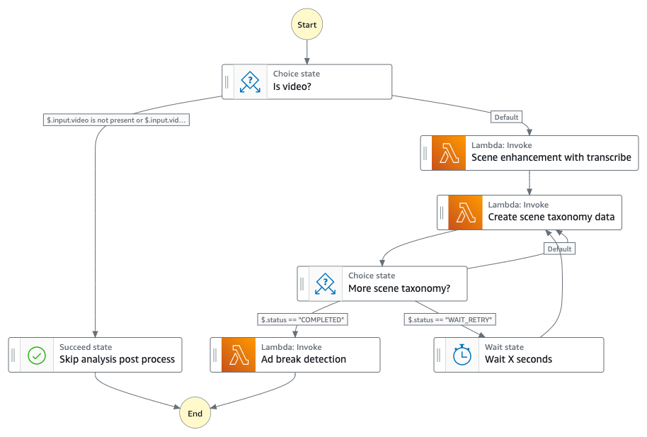

# Analysis Post Processing State Machine

This state machine is responsible for running additional analysis that requires a combination of the generated metadata. It handles video processing and performs tasks like scene enhancement, scene taxonomy creation, and ad break detection.




## _Execution input_

The workflow uses the following options.

```json
{
  ...
  "input": {
    "aiOptions": {
      "scene": true,
      "transcribe": true,
      "filters": {
        "transcode": {
          "cropX": 10,
          "cropY": 2
        },
        "adbreak": {
          "breakInterval": 180000,
          "breakOffset": 90000
        },
        "scene": {
          "enhanceWithTranscript": true,
          "enhanceWithLLM": true
        },
        "transcribe": {
          "analyseConversation": true
        }
      }
    },
    "destination": {
      "bucket": "[PROXY_BUCKET]",
      "prefix": "[PREFIX_OUTPUT]"
    },
    "video": {
      "enabled": true
    }
  },
  "data": {
    "video": {
      "rekognition": {
        "label": {
          "output": "[LABEL_JSON]"
        },
        "framesegmentation": {
          "key": "[FRAME_SEGMENTATION_JSON]"
        },
        "segment": {
          "output": "[SEGMENT_JSON]"
        },
        "scene": {
          "metadata": "[SCENE_JSON]",
          "embeddings": "[EMBEDDINGS_JSON]",
          "filterSettings": {
            "enhanceWithTranscript": true,
            "enhanceWithLLM": true
          }
        }
      }
    },
    "audio": {
      "transcribe": {
        "vtt": "[TRANSCRIPT_VTT]",
        "conversations": "[CONVERSATION_JSON]"
      },
      ...
    }
  }
}

```

## State Descriptions

#### _State: Is video?_

This state checks if the input contains a video. If the video is not present or disabled, it skips the analysis post-processing and transitions to the "Skip analysis post process" state.

#### _State: Scene enhancement with transcribe_

This state performs scene enhancement using the transcribe output and the conversation output by Anthropic Claude 3 Haiku (or Sonnet) model to merge scenes.

#### _State: Create scene taxonomy data_

This state creates scene taxonomy data using Amazon Bedrock (Anthropic Claude 3 Haiku or Sonnet model). The lambda function creates grid images by composing numbers of frame images of each scene. Along with the dialogues (from Amazon Transcribe) around each scene, it constructs a prompt and send to Anthropic Claude 3 model through Amazon Bedrock. The response contains following information:
1. Scene description
2. IAB Content Taxonomies
3. GARM Taxonomies
4. Sentiment of the scene
5. Brands and logos appeared on the scene

#### _State: More scene taxonomy?_

This is a choice state that checks the status of the scene taxonomy creation. If the status is "COMPLETED", it transitions to the "Ad break detection" state. If the status is "WAIT_RETRY", it transitions to the "Wait X seconds" state.

#### _State: Wait X seconds_

This state waits for the specified number of seconds (retrieved from the input data) before transitioning back to the "Create scene taxonomy data" state.

#### _State: Ad break detection_

This state performs ad break detection by leveraging the scene detection results, the momentary loudness measurement generated by AWS Elemental MediaConvert, frame embedding results from the [Custom model detection state machine](../video/README_CUSTOM_MODEL_WORKFLOW.md#state-run-scene-embeddings), Amazon Rekognition Label detection results, and Amazon Rekognition Shot Segment results. The lambda function uses the information to calculate and assign a weight to the boundaries of each scene. The top results are promoted to ad breaks along with the contextual and taxonomy information describe earlier.

#### _State: Skip analysis post process_

This is a success state that is reached when the video is not present or disabled, skipping the analysis post-processing.

## IAM Role Policy

### _AnalysisPostProcessLambda_

```json
{
    "Version": "2012-10-17",
    "Statement": [
        {
            "Action": [
                "logs:CreateLogGroup",
                "logs:CreateLogStream",
                "logs:PutLogEvents"
            ],
            "Resource": "[CLOUDWATCH_LOGS]",
            "Effect": "Allow"
        },
        {
            "Action": "s3:ListBucket",
            "Resource": "[PROXY_BUCKET]",
            "Effect": "Allow"
        },
        {
            "Action": [
                "s3:GetObject",
                "s3:PutObject"
            ],
            "Resource": "[PROXY_BUCKET]",
            "Effect": "Allow"
        },
        {
            "Action": "dynamodb:Query",
            "Resource": "[AIML_TABLE]",
            "Effect": "Allow"
        },
        {
            "Action": "bedrock:InvokeModel",
            "Resource": [
                "ANTHROPIC_CLAUDE_3_MODELS"
            ],
            "Effect": "Allow"
        }
    ]
}
```

## Related Topics

- [Video Analysis State Machine](../video/README.md)
- [Custom Model Detection State Machine](../video/README_CUSTOM_MODEL_WORKFLOW.md)

__

Back to [Main State Machine](../../README.md) | Back to [Table of contents](../../../../README.md#table-of-contents)