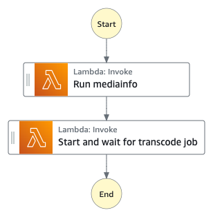
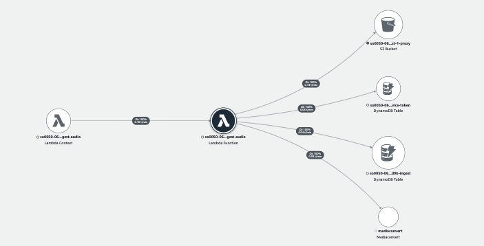

# Audio Ingest State Machine

The Audio Ingest State Machine contains two steps. It first runs MediaInfo opensource tool to extract the technical metadata of the audio file. It then uses AWS Elemental MediaConvert to create a proxy version of the audio file in M4A format.

Please refer to [the supported input audio codec and container](https://docs.aws.amazon.com/mediaconvert/latest/ug/reference-codecs-containers-input.html#reference-codecs-containers-input-audio).





#### _State: Run mediainfo_

The lambda function uses [MediaInfo](https://github.com/MediaArea/MediaInfo) opensource tool to extract technical metadata and a cover art of the audio file. It stores the technical metadata (JSON format) in the Amazon S3 proxy bucket and updates the **mediainfo** field in the Amazon DynamoDB ingest table.


#### _State: Start and wait for transcode job_

The Audio Ingest workflow supports various audio formats and codecs of the ingested media file by leveraging [AWS Elemental MediaConvert](https://aws.amazon.com/mediaconvert/) service. It creates the "standardized" M4A proxy audio output to simplify the downstream analysis workflows.

To support a large number of concurrent requests, the lambda function leverages the [Service Backlog Management System](../../../layers/service-backlog-lib/README.md) to queue the transcoding job request and waits for the job to be processed.

The Backlog system processes the request by running the AWS Elemental MediaConvert CreateJob API and waits for the job to complete. When the transcoding job is completed, it sends the task result back to the Audio Ingest State Machine to complete the request. Refer to the [Service Backlog Management System](../../../layers/service-backlog-lib/README.md) to understand how that works. Then, the Audio Ingest State Machine can resume and comletes the workflow.

__

#### _Proxies and Metadata location_

Audio Ingest State Machine generates the following outputs:
- MediaInfo JSON output
- M4A proxy audio and
- Cover art image

|Output|Location|
|:--|:--|
|MediaInfo JSON|s3://[PROXY_BUCKET]/[UUID]/mediainfo/mediainfo.json|
|Proxy M4A audio|s3://[PROXY_BUCKET]/[UUID]/transcode/aiml/[FILENAME].m4a|
|Cover art image|s3://[PROXY_BUCKET]/[UUID]/transcode/proxy/cover.jpg|


### AWS Lambda function (ingest-audio)

The ingest-audio lambda function provides the implementation to support different states of the Audio Ingest state machine. It requires permission to perform the followings:
- Read ingested media file from the Amazon S3 (INGEST_BUCKET)
- Read and write the proxy outputs from the Amazon S3 (PROXY_BUCKET)
- Update status to the Amazon DynamoDB (INGEST_TABLE)
- Register the job request to the Amazon DynamoDB (SERVICE_TOKEN_TABLE)
- Create a transcoding job on AWS Elemental MediaConvert
- Pass an IAM role (DATA_ACCESS_ROLE) to the AWS Elemental MediaConvert service
- Allows the Service Backlog System to send notification to an Amazon EventBridge (SERVICE_BACKLOG_EVENT_BUS)


#### _IAM Role Policy_

```json
{
    "Version": "2012-10-17",
    "Statement": [
        {
            "Action": [
                "logs:CreateLogGroup",
                "logs:CreateLogStream",
                "logs:PutLogEvents"
            ],
            "Resource": "[CLOUDWATCH_LOGS]",
            "Effect": "Allow"
        },
        {
            "Action": "s3:ListBucket",
            "Resource": "[INGEST_BUCKET]",
            "Effect": "Allow"
        },
        {
            "Action": "s3:GetObject",
            "Resource": "[INGEST_BUCKET]",
            "Effect": "Allow"
        },
        {
            "Action": "s3:ListBucket",
            "Resource": "[PROXY_BUCKET]",
            "Effect": "Allow"
        },
        {
            "Action": [
                "s3:GetObject",
                "s3:PutObject"
            ],
            "Resource": "[PROXY_BUCKET]",
            "Effect": "Allow"
        },
        {
            "Action": [
                "mediaConvert:CreateJob",
                "mediaConvert:GetJob"
            ],
            "Resource": "[MEDIACONVERT_JOB]",
            "Effect": "Allow"
        },
        {
            "Action": [
                "iam:GetRole",
                "iam:PassRole"
            ],
            "Resource": "[DATA_ACCESS_ROLE]",
            "Effect": "Allow"
        },
        {
            "Action": [
                "dynamodb:Scan",
                "dynamodb:Query",
                "dynamodb:PutItem",
                "dynamodb:UpdateItem",
                "dynamodb:DeleteItem"
            ],
            "Resource": [
                "[INGEST_TABLE]",
                "[SERVICE_TOKEN_TABLE]"
            ],
            "Effect": "Allow"
        },
        {
            "Action": "events:PutEvents",
            "Resource": "[SERVICE_BACKLOG_EVENTBUS]",
            "Effect": "Allow"
        }
    ]
}

```

#### _X-Ray Trace_

The following AWS XRAY trace diagram illustrates the AWS resources this lambda function communicates to.



__

## IAM Role Permisssion

```json
{
    "Version": "2012-10-17",
    "Statement": [
        {
            "Action": "s3:ListBucket",
            "Resource": "INGEST_BUCKET",
            "Effect": "Allow"
        },
        {
            "Action": "s3:GetObject",
            "Resource": "INGEST_BUCKET",
            "Effect": "Allow"
        },
        {
            "Action": "s3:ListBucket",
            "Resource": "PROXY_BUCKET",
            "Effect": "Allow"
        },
        {
            "Action": [
                "s3:GetObject",
                "s3:PutObject"
            ],
            "Resource": "PROXY_BUCKET",
            "Effect": "Allow"
        },
        {
            "Action": [
                "mediaConvert:CreateJob",
                "mediaConvert:GetJob"
            ],
            "Resource": "arn:aws:mediaconvert:REGION:ACCOUNTID:*",
            "Effect": "Allow"
        },
        {
            "Action": [
                "iam:GetRole",
                "iam:PassRole"
            ],
            "Resource": "SERVICE_DATA_ACCESS_ROLE",
            "Effect": "Allow"
        },
        {
            "Action": [
                "dynamodb:Scan",
                "dynamodb:Query",
                "dynamodb:UpdateItem",
                "dynamodb:DeleteItem"
            ],
            "Resource": [
                "INGEST_TABLE",
                "SERVICE_TOKEN_TABLE"
            ],
            "Effect": "Allow"
        }
    ]
}
```
__

## Related topics
- [Using State Machine Service Integration with AWS Elemental MediaConvert service](../automation/README.md#state-machine-service-integration)
- [Handling changes on Ingest Table with Amazon DynamoDB Streams](../automation/README.md#handling-changes-on-ingest-table)
- [Service Backlog Management System](../../../layers/service-backlog-lib/README.md)

__

Back to [Ingest Main State Machine](../main/README.md) | Back to [Table of contents](../../../../README.md#table-of-contents)
