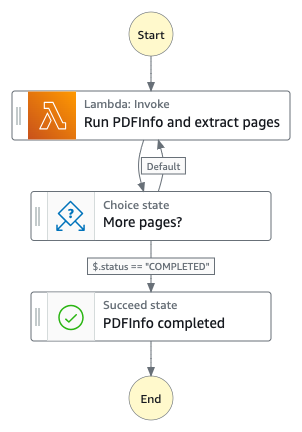

# Document Ingest State Machine

The Document Ingest State Machine uses PDF.JS to extract metadata of the PDF file and create image files of the PDF file.




#### _State: Run PDFInfo and extract pages_

The lambda function uses [Mozillia PDF.JS](https://github.com/mozilla/pdf.js) opensource tool to extract document metadata and pages and uses [Node Canvas](https://github.com/Automattic/node-canvas) to convert pages into PNG images. The document metadata and the PNG proxy images are stored to the Amazon S3 proxy bucket. The lambda function also updates the **docinfo** field in the Amazon DynamoDB ingest table. If the lambda function extracts and processes all the pages, it sets the $.status to COMPLETED indicating the extraction process has completed. Otherwise, the lambda function sets the $.status to PROCESSING indicating there are more pages to be processed.

#### _State: More pages?_

If the status is "COMPLETED," the workflow proceeds to the "PDFInfo completed" indicating the state machine has completed. Otherwise, it transitions back to the "Run PDFInfo and extract pages" state to resume the extraction process. 


#### _State: PDFInfo completed_

A Succeed state indicated the process completes.

__

#### _Image proxy output location_

Document Ingest State Machine generates images (one image per page) from the document.

|Output|Location|
|:--|:--|
|Page images|s3://[PROXY_BUCKET]/[UUID]/[FILE_BASENAME]/transcode/proxy/XXXXXXXX.png|

__

### AWS Lambda function (ingest-document)

The ingest-document lambda function provides the implementation to support multiple states of the ingest document state machine. It requires permission to access the INGEST_BUCKET, PROXY_BUCKET, and the INGEST_TABLE.

#### _IAM Role Policy_

```json

{
    "Version": "2012-10-17",
    "Statement": [
        {
            "Action": [
                "logs:CreateLogGroup",
                "logs:CreateLogStream",
                "logs:PutLogEvents"
            ],
            "Resource": "[CLOUDWATCH_LOGS]",
            "Effect": "Allow"
        },
        {
            "Action": "s3:ListBucket",
            "Resource": "[INGEST_BUCKET]",
            "Effect": "Allow"
        },
        {
            "Action": "s3:GetObject",
            "Resource": "[INGEST_BUCKET]",
            "Effect": "Allow"
        },
        {
            "Action": "s3:ListBucket",
            "Resource": "[PROXY_BUCKET]",
            "Effect": "Allow"
        },
        {
            "Action": [
                "s3:GetObject",
                "s3:PutObject"
            ],
            "Resource": "[PROXY_BUCKET]",
            "Effect": "Allow"
        },
        {
            "Action": [
                "dynamodb:Scan",
                "dynamodb:Query",
                "dynamodb:UpdateItem",
                "dynamodb:DeleteItem"
            ],
            "Resource": "[INGEST_TABLE]",
            "Effect": "Allow"
        }
    ]
}

```

#### _X-Ray Trace_

The AWS XRAY trace diagram, shown below, illustrates the AWS services this lambda function communicates to.


__

Back to [Ingestion Main State Machine](../main/README.md) | Back to [Table of contents](../../../../README.md#table-of-contents)
