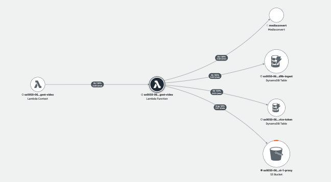

# Video Ingest State Machine

The Video Ingest State Machine uses MediaInfo opensource tool to extract the technical metadata of the video file. It then uses AWS Elemental MediaConvert to create a proxy version of the video file in MP4 format for Video Analysis workflow, an audio proxy file in M4A format for Audio Analysis workflow, and frame capture images for Frame Based Analysis workflow. The video ingest state machine uses Jimp opensource tool to compute Perceptual Hash and Laplacian Variant of the frame images.

Refer to [the supported input video codec and container](https://docs.aws.amazon.com/mediaconvert/latest/ug/reference-codecs-containers-input.html#reference-codecs-containers-input-video).


#### _State: Run mediainfo_

The lambda function uses [MediaInfo](https://github.com/MediaArea/MediaInfo) opensource tool to extract the technical metadata of the video file such as container format, duration, framerate, resolution, video and audio formats. It stores the technical metadata (in JSON format) to the Amazon S3 proxy bucket and updates the **mediainfo** field in the Amazon DynamoDB ingest table.

#### _State: Start and wait for mediaconvert job_

The Video Ingest workflow supports various video formats and codecs of the ingested media file by leveraging [AWS Elemental MediaConvert](https://aws.amazon.com/mediaconvert/) service. It creates the "standardized" proxy outputs to simplify the downstream analysis workflows.

The proxies this workflow created include:
- a MP4 video proxy file, used for "Video Analysis"
- a M4A audio proxy file, used for "Audio Analysis"
- frame capture images, used for "Frame Based and Dynamic Frame Analysis"

To support a large number of concurrent requests, the lambda function leverages the [Service Backlog Management System](../../../layers/service-backlog-lib/README.md) to queue the transcoding job request and waits for the job to be processed.

The Backlog system processes the request by running the AWS Elemental MediaConvert CreateJob API and waits for the job to complete. When the transcoding job is completed, it sends the task result back to the Video Ingest State Machine to complete the request. Refer to the [Service Backlog Management System](../../../layers/service-backlog-lib/README.md) to understand how that works. Then, the Video Ingest State Machine can resume and execute the next step, "Has frame capture group?".


#### _State: Has frame capture group?_

The Choice state checks if Frame Based Analysis flags, `$.input.aiOptions.framebased` and `$.input.aiOptions.frameCaptureMode`. If the framebased is set to `true` and frameCaptureMode is greater than `0`, the workflow transitions to the "Compute perceptual hashes" state to calculate hash and laplacian variant values of the frame images. Otherwise, the workflow moves to "Ingest completed" indicating the video ingest process has completed.

#### _State: Compute perceptual hashes_

The lambda function uses [Jimp](https://github.com/oliver-moran/jimp) to calculate the Perceptual Hash and the Laplacian Variant values of each frame image. These values are used in the [Dynamic Frame Segmentation Workflow](../../analysis/video/README_DYNAMIC_FRAME_WORKFLOW.md) to intelligently select "relevant" frames for video analysis.

The lambda function stores the results, named **frameHash.json** to the Amazon S3 proxy bucket. Here is a snippet of the frameHashes.json.

```json
[
  {
    "name": "frame.0000001.jpg",
    "frameNo": 24,
    "timestamp": 1001,
    "hash": "cg880000000",
    "laplacian": 309
  },
  ...
]
```

When the lambda function calculates the hashes and laplacian variant values for all frame images, it set `$.status` to "COMPLETED". Otherwise, it set `$.status` to "PROCESSING" indicating there are more frame images to be processed.


#### _State: More hashes?_

If the status is "COMPLETED," the workflow proceeds to the "Ingest completed" indicating the state machine has completed. Otherwise, it transitions back to the "Compute perceptual hashes" state to resume the process. 

#### _State: Ingest completed_

A Succeed state indicated the video ingest process completes.

__

#### _Proxies and Metadata location_

Video Ingest State Machine generates the following outputs:
- MediaInfo JSON output
- Various proxy files and frame capture images
- Perceptual Hashes and Laplacian Variants JSON output

|Output|Location|
|:--|:--|
|MediaInfo JSON|s3://[PROXY_BUCKET]/[UUID]/mediainfo/mediainfo.json|
|Proxy MP4 video|s3://[PROXY_BUCKET]/[UUID]/transcode/aiml/[FILENAME].mp4|
|Proxy M4A audio|s3://[PROXY_BUCKET]/[UUID]/transcode/aiml/[FILENAME].m4a|
|Frame capture images|s3://[PROXY_BUCKET]/[UUID]/transcode/frameCapture/frame.XXXXXXX.jpg|
|Perceptual Hashes and Laplacian Variants|s3://[PROXY_BUCKET]/[UUID]/transcode/frameCapture/frameHashes.json|

__

### AWS Lambda function (ingest-video)

The ingest-video lambda function provides the implementation to support different states of the Video Ingest state machine. It requires permission to perform the followings:
- Read ingested media file from the Amazon S3 (INGEST_BUCKET)
- Read and write the proxy outputs from the Amazon S3 (PROXY_BUCKET)
- Update status to the Amazon DynamoDB (INGEST_TABLE)
- Register the job request to the Amazon DynamoDB (SERVICE_TOKEN_TABLE)
- Create a transcoding job on AWS Elemental MediaConvert
- Pass an IAM role (DATA_ACCESS_ROLE) to the AWS Elemental MediaConvert service
- Allows the Service Backlog System to send notification to an Amazon EventBridge (SERVICE_BACKLOG_EVENT_BUS)


#### _IAM Role Policy_

```json

{
    "Version": "2012-10-17",
    "Statement": [
        {
            "Action": [
                "logs:CreateLogGroup",
                "logs:CreateLogStream",
                "logs:PutLogEvents"
            ],
            "Resource": [
                "[CLOUDWATCH_LOGS]"
            ],
            "Effect": "Allow"
        },
        {
            "Action": "s3:ListBucket",
            "Resource": "[INGEST_BUCKET]",
            "Effect": "Allow"
        },
        {
            "Action": "s3:GetObject",
            "Resource": "[INGEST_BUCKET]",
            "Effect": "Allow"
        },
        {
            "Action": "s3:ListBucket",
            "Resource": "[PROXY_BUCKET]",
            "Effect": "Allow"
        },
        {
            "Action": [
                "s3:GetObject",
                "s3:PutObject"
            ],
            "Resource": "[PROXY_BUCKET]",
            "Effect": "Allow"
        },
        {
            "Action": [
                "mediaConvert:CreateJob",
                "mediaConvert:GetJob"
            ],
            "Resource": "[MEDIACONVERT_JOB]",
            "Effect": "Allow"
        },
        {
            "Action": [
                "iam:GetRole",
                "iam:PassRole"
            ],
            "Resource": "[DATA_ACCESS_ROLE]",
            "Effect": "Allow"
        },
        {
            "Action": [
                "dynamodb:Scan",
                "dynamodb:Query",
                "dynamodb:PutItem",
                "dynamodb:UpdateItem",
                "dynamodb:DeleteItem"
            ],
            "Resource": [
                "[INGEST_TABLE]",
                "[SERVICE_TOKEN_TABLE]"
            ],
            "Effect": "Allow"
        },
        {
            "Action": "events:PutEvents",
            "Resource": "[SERVICE_BACKLOG_EVENTBUS]",
            "Effect": "Allow"
        }
    ]
}

```

#### _X-Ray Trace_

The following AWS XRAY trace diagram illustrates the AWS resources this lambda function communicates to.



__

## Related topics
- [Automation: State Machine Service Integration / DDB Stream Connector](../automation/README.md)
- [Dynamic Frame Segmentation Workflow](../../analysis/video/README_DYNAMIC_FRAME_WORKFLOW.md)
- [Service Backlog Management System](../../../layers/service-backlog-lib/README.md)

__

Back to [Ingest State Machine](../main/README.md) | Back to [Table of contents](../../../../README.md#table-of-contents)
